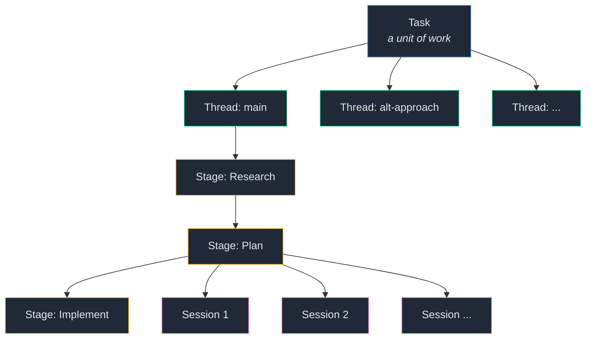

# ally

**A VIM-like terminal harness orchestrator for AI-driven development workflows.**

<!-- screenshot: hero GIF showing ally in action — stage view with chat + artifact panels -->

ally is a terminal UI that sits on top of your AI coding harness and gives it structure. Define multi-stage workflows that match how you actually engineer and let ally orchestrate your AI agents through each phase. If you live in the terminal and use VIM keybindings, ally feels like home.

## Why ally

AI chat interfaces are flat. You paste context, lose threads, and start over when the conversation drifts. There's no way to express a multi-step engineering process, and no structure to build on.

ally fixes this with four abstractions:

- **Workflows** — YAML templates that define your engineering process as sequential stages (e.g., Research → Plan → Implement). Each stage can reference artifacts from previous stages.
- **Tasks** — units of work. A task is a feature, a bug fix, an investigation.
- **Threads** — independent execution paths within a task. Fork a thread to explore an alternative approach without losing the original.
- **Sessions** — AI conversations within a stage. Run multiple sessions per stage to try different prompts or models, and switch between them instantly.



## Quick Start

1. **Install ally.**

   **Homebrew (macOS & Linux):**
   ```bash
   brew tap Tomskoo/ally
   brew install ally
   ```

   **Or download a tarball** from [GitHub Releases](https://github.com/Tomskoo/ally/releases):
   ```bash
   # macOS ARM64 (Apple Silicon)
   curl -L https://github.com/Tomskoo/ally/releases/latest/download/ally-darwin-arm64.tar.gz | tar xz
   xattr -d com.apple.quarantine ally/ally   # macOS: remove Gatekeeper quarantine
   ```

2. **Start OpenCode** — ally connects to a running [OpenCode](https://github.com/anthropics/opencode) server:
   ```bash
   opencode serve
   ```

3. **Run ally** in your project directory:
   ```bash
   ally        # if installed via brew
   ./ally/ally # if extracted from a tarball
   ```

4. **Create your first task** from the board view, assign a workflow, and start working.

ally creates an `.ally/` directory in your project root to store tasks, threads, and workflow definitions.

## Concepts

**Task** — A unit of work with a name and description. Contains one or more threads.

**Thread** — An execution path within a task, tied to a workflow. Each thread tracks which stage you're on and preserves session history. Create multiple threads to explore different approaches.

**Stage** — A phase in your workflow. Stages run sequentially and can produce artifacts (markdown files) that feed into later stages via variable interpolation.

**Session** — A single AI conversation within a stage. Each stage can hold multiple sessions. Switch between them with `{` and `}`, or create a new one with `N`.

## Workflows

Workflows are YAML files stored in `.ally/workflows/`. They define the stages of your engineering process.

### Research-Plan-Implement

A three-stage workflow where research feeds into planning, and planning feeds into implementation:

```yaml
name: Research-Plan-Implement
description: Standard 3 tier workflow
stages:
  - id: research
    name: Research
    description: Launch The Analyzers
    starting_prompt: /research $research
    product: research-artifact.md
  - id: plan
    name: Plan
    description: Plan based on research
    starting_prompt: /plan $research $plan
    product: plan-artifact.md
  - id: implement
    name: Implement
    description: Implement based on plan
    starting_prompt: /implement $plan
```

- **`starting_prompt`** — sent to the AI agent when you enter the stage. Use `$stage_id` to interpolate artifacts from previous stages.
- **`product`** — the filename for the stage's output artifact, saved in the thread directory.

### Minimal: Just Work

A single-stage workflow for when you don't need structure:

```yaml
name: Just Work
description: Single Stage
stages:
  - id: the-only-stage
    name: The Only Stage
    description: Do all of your work here
    starting_prompt: ""
```

You can create workflows through the TUI (command `:workflows`) or by writing YAML directly.

## The Stage View

The stage view is where you do your work. It has two panels:

- **Chat panel** — your conversation with the AI agent. Type in insert mode, send with `Alt+Enter`. Navigate messages with `J`/`K`.
- **Artifact panel** — the stage's output, rendered with TreeSitter syntax highlighting. Toggle between rendered and raw views with `r`.

Switch between panels with `Tab`. Cycle through stages with `[` and `]`.

Each stage maintains independent sessions. Switch sessions with `{`/`}`, or start a fresh one with `N` — the previous session is preserved and you can return to it.

## Commands

Press `:` to open the command bar. All commands support autocomplete with `Tab`.

| Command | Description |
|---------|-------------|
| `:board` | Go to the task board |
| `:task <name>` | Jump to a task (fuzzy match) |
| `:thread <name>` | Jump to a thread in current task |
| `:stage <slug>` | Jump to a stage in current thread |
| `:workflows` | Go to the workflow list |
| `:quickchat` | Toggle quick chat overlay |
| `:back` | Navigate back |
| `:forward` | Navigate forward |
| `:help` | Show available commands |
| `:q` / `:quit` | Quit |

## Keybindings

All keybindings are customizable via `.ally/config.yaml`. Defaults below.

### VIM Motion

| Key | Action |
|-----|--------|
| `j` / `↓` | Move down |
| `k` / `↑` | Move up |
| `h` / `←` | Move left |
| `l` / `→` | Move right |
| `i` | Enter insert mode |
| `v` | Enter visual mode |
| `Esc` / `n` | Exit visual mode |
| `y` | Yank selection to clipboard |

### Chat

| Key | Action |
|-----|--------|
| `J` / `Shift+↓` | Next message |
| `K` / `Shift+↑` | Previous message |
| `Alt+J` / `Alt+↓` | Next user message |
| `Alt+K` / `Alt+↑` | Previous user message |
| `Alt+Enter` | Send message |
| `Tab` | Toggle chat/artifact panel |
| `N` | New session |
| `{` / `}` | Previous / next session |

### Navigation

| Key | Action |
|-----|--------|
| `[` / `]` | Cycle through stages |
| `Esc` | Back / dismiss overlay |
| `Alt+P` | Focus provider bar |
| `Alt+W` | Toggle quick chat |
| `:` | Open command bar |

### Artifact

| Key | Action |
|-----|--------|
| `↑` / `↓` | Scroll |
| `r` | Toggle rendered / raw view |
| `R` | Force reload artifact |

## Configuration

ally uses two configuration locations:

- **`.ally/config.yaml`** — per-project settings (created on first run)
- **`~/.config/ally/`** — global settings, themes, and TreeSitter queries

### Example config

```yaml
opencode:
  default_provider: opencode-go
  lock_provider: false
  model_per_provider:
    opencode-go: claude-sonnet-4-20250514

rendering:
  theme: monokai-pro
  query_dirs:
    - ~/.local/share/nvim/lazy/nvim-treesitter/queries

hotkeys:
  chat.send_message:
    - <alt>+<enter>
  vim.up:
    - k
    - <up>
  # Override any binding with a list of key combos
```

- **`opencode`** — provider selection, model per provider, server URL, provider locking
- **`rendering`** — color theme, TreeSitter query directories for syntax highlighting
- **`hotkeys`** — override any keybinding by its dotted name (e.g., `chat.send_message`, `vim.up`)

## Themes

ally ships with the **Tokyo Night** theme. Custom themes are YAML files placed in `~/.config/ally/themes/` that define a color palette and TreeSitter highlight mappings. Set the active theme in your config:

```yaml
rendering:
  theme: monokai-pro
```

## Architecture

ally is a frontend for [OpenCode](https://github.com/anthropics/opencode). OpenCode runs as a server that manages AI sessions, executes agent commands, and integrates with multiple AI providers. ally communicates with OpenCode over HTTP for requests and Server-Sent Events (SSE) for real-time streaming.

This separation means ally handles workflow orchestration, navigation, and rendering, while OpenCode handles model execution and tool use. You can configure different AI providers and models per provider through ally's config or provider bar.

## File Structure

Everything ally persists is in the `.ally/` directory — human-readable YAML, easy to inspect and version control.

```
.ally/
├── config.yaml
├── workflows/
│   └── research-plan-implement/
│       └── workflow.yaml
└── tasks/
    └── build-auth/
        ├── task.yaml
        └── threads/
            └── main/
                ├── thread.yaml
                └── research/
                    └── artifact.md
```

## Platforms

Pre-built binaries are available for:

- macOS ARM64 (Apple Silicon)
- macOS x86_64 (Intel)
- Linux x86_64 (glibc ≥ 2.35)
- Linux arm64 (glibc ≥ 2.35)

Windows: run the Linux x86_64 binary inside WSL2. A native Windows build is planned for a future release.

Download from [GitHub Releases](https://github.com/Tomskoo/ally/releases) or install via `brew tap Tomskoo/ally && brew install ally`.

## Building from Source

Requires [Bazel](https://bazel.build/) (or [Bazelisk](https://github.com/bazelbuild/bazelisk)).

```bash
git clone https://github.com/Tomskoo/ally.git
cd ally
bazel build //src/app:ally
```

For an optimized release build:

```bash
bazel build --config=release //src/app:ally_release
```

## License

MIT
